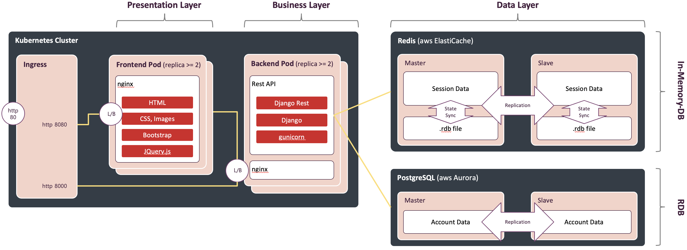
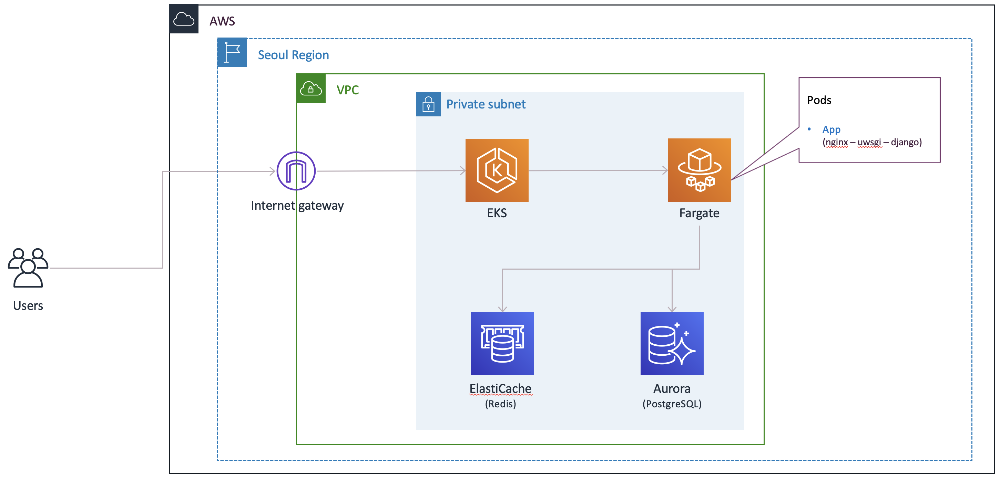
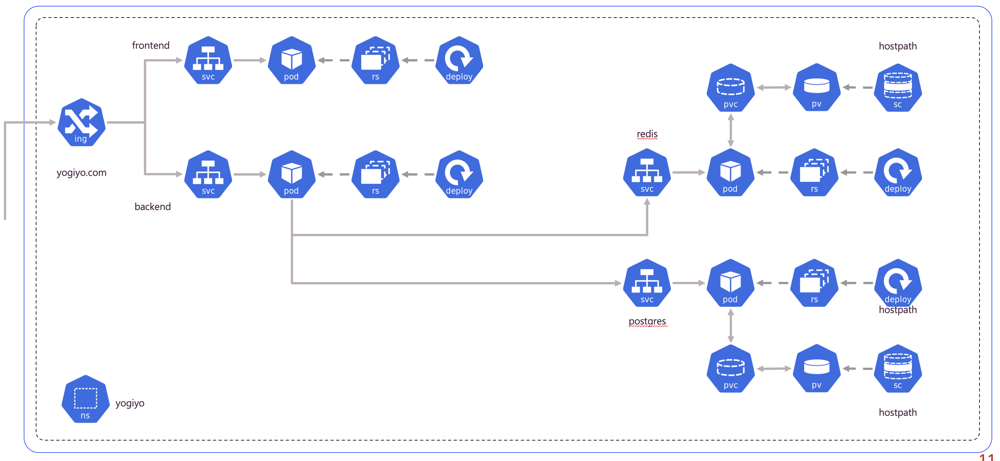

# k8s-django-demo
This is a simple guestbook application to demonstrate how kubernetes is useful for Devs in developing services not relying on Ops as much as possible.

This project contains application source code along with the following kubernetes objects:
 - **Ingress** (Router)
 - ~~**NetworkPolicy** (Firewall)~~
 - **Service** (Load Balancer)
 - **ConfigMap** (for non-confidential key-value data repository)
 - **PersistentVolume/PersistentVolumeClaim** (Storage)
 - **Deployment** (for frontend, backend, database Pods)
 - **StatefulSet** (for db master/slave)
 - **HorizontalPodAutoscaler** (for auto scailing)

Also, there are terraform configurations to create **EKS - Fargate** (serverless k8s cluster).

## Architecture

<p align="center">[Figure 1: Logical Architecture]</p>


<p align="center">[Figure 2: Deployment Architecture]</p>


<p align="center">[Figure 3: Kubernetes Diagram]</p>


Frontend: Bootstrap/AJAX, nginx
Backend: Python Django

## Prerequisites

 - **Hyperkit**: ```brew install hyperkit```
 - **Minikube**: ```brew install minikube```
 - **kubectl**: ```brew install kubernetes-cli```
 - **Skaffold**: ```brew install skaffold```
 - **Visual Studio Code**: ```brew install --cask visual-studio-code```
 - **Python VSCode Extension**: [Installation](https://marketplace.visualstudio.com/items?itemName=ms-python.python)
 - **Cloud Code VSCode Extension**: [Installation](https://marketplace.visualstudio.com/items?itemName=GoogleCloudTools.cloudcode)
 

## Project Directory Structure
Below is a project directory structure.

> Note: you do not need to follow this structure exactly but this is a suggestion by google.

~~~
.
|---- doc
|     |---- images
|---- terraform-manifests
|     |---- prod
|---- kubernetes-manifests
|     |---- local
|     |---- prod
|---- src
|     |---- backend
|     |---- frontend
└---- skaffold.yaml
~~~

Each directory contains:
 - **doc**: documents and images that are not relavant to any part of service
 - **terraform-configurations**: terraform files to create/manage VPC, EKS - Fargate, etc.
 - **kubernetes-manifests**: all kubernetes objects such as Ingress, Deployments, etc.
 - **src**: source code directory for backend and frontend. Typically this is a root directory of non kubernetes project.

## Deployment

### Local Environment
Minikube is a tool that makes it easy to run Kubernetes locally. Minikube runs a single-node Kubernetes cluster inside a Virtual Machine (VM) on your laptop for users looking to try out Kubernetes or develop with it day-to-day.

#### Configuring a Kubernetes Cluster
Creating and configuring a kubernetes cluster is really simple on Minikube. Just run following commands:

~~~bash
# set memory, cpu and vm driver
minikube config set memory 8192
minikube config set cpus 4
minikube config set vm-driver hyperkit

# increase minikube disk size, default is 2GB
minikube config set disk-size 20240
~~~

This will change ```~/.minikube/config/config.json``` file and the configurations is valid until cluster is deleted by ```minikube delete``` which deletes current configured a kubernetes cluster. The current cluster configuration info can be checked by following command.

~~~bash
minikube config view
~~~

#### Creating and Starting a Kubernetes Cluster
Run below command in order to execute a kubernetes cluster using minikube.

~~~ bash
minikube start
~~~

When using a single VM for Kubernetes, it’s useful to reuse Minikube’s built-in Docker daemon. Reusing the built-in daemon means you don’t have to build a Docker registry on your host machine and push the image into it. Instead, you can build inside the same Docker daemon as Minikube, which speeds up local experiments.

> Note: Be sure to tag your Docker image with something other than latest and use that tag to pull the image. Because :latest is the default value, with a corresponding default image pull policy of Always, an image pull error (ErrImagePull) eventually results if you do not have the Docker image in the default Docker registry (usually DockerHub).

To work with the Docker daemon on your Mac/Linux host, run the last line from ```minikube docker-env``` as below.

~~~ bash
a202103023@A202103023-03:~/Work/k8s-django-demo$ minikube docker-env
export DOCKER_TLS_VERIFY="1"
export DOCKER_HOST="tcp://192.168.64.3:2376"
export DOCKER_CERT_PATH="/Users/a202103023/.minikube/certs"
export MINIKUBE_ACTIVE_DOCKERD="minikube"

# To point your shell to minikube's docker-daemon, run:
# eval $(minikube -p minikube docker-env)
~~~

Then execute following command to use minikube docker engine.

~~~bash
eval $(minikube -p minikube docker-env)
~~~

You can now use docker at the command line of your host Mac/Linux machine to communicate with the docker daemon inside the Minikube VM:

~~~ bash
docker ps
~~~

For more information regarding minikube and kubernetes, refer to [Installing Kubernetes with Minikube](https://kubernetes.io/docs/setup/learning-environment/minikube/).

#### Enabling Required Minikube Addons
In order to use minikube addons such as dashboard and ingress, addons neeed to be enabled as below:

~~~ bash
# show entire minikube addons
minikube addons list

# enable specific addon
minikube addons enable dashboard
minikube addons enable ingress
minikube addons enable metrics-server

# check above addons are enabled properly
minikube addons list
~~~

#### How to Deploy and Start Service
~~~bash
# switch to minikube context
kubectl config use-context minikube

# Start minikube first
minikube start

# Deploy application
#skaffold dev -v info --port-forward
./deploy_to_local.sh
~~~

#### How to Stop Service and Undeploy

~~~ bash
(CTRL-C to stop running application)

# Stop minikube
minikube stop
~~~

#### How to Test

 - [Frontend](http://localhost:8080)
 - [Backend Swagger](http://localhost:8000/swagger)
 - [Backend Redoc](http://localhost:8000/redoc)


### Production Environment  