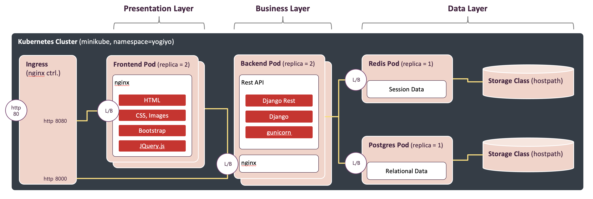
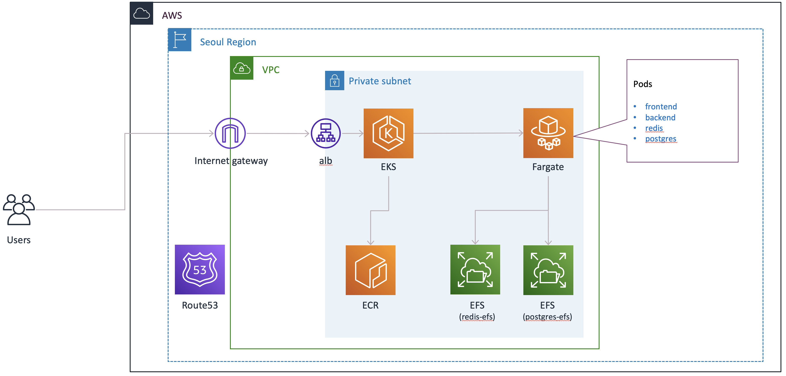

# k8s-django-demo

This is a simple forum application to demonstrate how kubernetes is useful for Devs in developing services not relying on Ops as much as possible.

This project contains application source code along with the following kubernetes objects:

- **Ingress** (Router)
- ~~**NetworkPolicy** (Firewall)~~
- **Service** (Load Balancer)
- **ConfigMap** (for non-confidential key-value data repository)
- **PersistentVolume/PersistentVolumeClaim** (Storage)
- **Deployment** (for frontend, backend, database Pods)
- ~~**StatefulSet** (for db cluster)~~
- **HorizontalPodAutoscaler** (for auto scailing)

Also, there are terraform configurations to create **EKS - Fargate** (serverless k8s cluster).

## Architecture


<p align="center">[Figure 1: Logical Architecture]</p>


<p align="center">[Figure 2: Kubernetes Diagram]</p>

## Prerequisites

- **Minikube Driver**
  - Intel Chip: ```brew install hyperkit```
  - Apple Chip: [Docker](https://docs.docker.com/desktop/mac/install/)
- **Minikube**: ```brew install minikube```
- **kubectl**: ```brew install kubernetes-cli```
- **Skaffold**: ```brew install skaffold```
- **Visual Studio Code**: ```brew install --cask visual-studio-code```
- **Python VSCode Extension**: [Installation](https://marketplace.visualstudio.com/items?itemName=ms-python.python)
- **Cloud Code VSCode Extension**: [Installation](https://marketplace.visualstudio.com/items?itemName=GoogleCloudTools.cloudcode)

## Project Directory Structure

Below is a project directory structure.

> Note: you do not need to follow this structure exactly but this is a suggestion by google.

~~~ bash
.
|---- doc
|     |---- images
|---- terraform-manifests
|     |---- prod
|---- kubernetes-manifests
|     |---- local
|     |---- prod
|---- src
|     |---- backend
|     |---- frontend
└---- skaffold.yaml
~~~

Each directory contains:

- **doc**: documents and images that are not relavant to any part of service
- **terraform-configurations**: terraform files to create/manage VPC, EKS - Fargate, etc.
- **kubernetes-manifests**: all kubernetes objects such as Ingress, Deployments, etc.
- **src**: source code directory for backend and frontend. Typically this is a root directory of non kubernetes project.

## Deployment - Local Environment

Minikube is a tool that makes it easy to run Kubernetes locally. Minikube runs a single-node Kubernetes cluster inside a Virtual Machine (VM) on your laptop for users looking to try out Kubernetes or develop with it day-to-day.

### Configuring Docker Desktop (Apple Chip Only)

We need to increase allocated resources to Docker Desktop in order to use minikube with. Increase CPUs, Memory and Swap to 6 core, 16GB and 2GB as below at the preferences of Docker Desktop.


<p align="center">[Preferences - Resources, Docker Desktop]</p>

### Configuring a Kubernetes Cluster

Creating and configuring a kubernetes cluster is really simple on Minikube. Just run following commands:

~~~bash
# set memory, cpu and vm driver
minikube config set memory 8192
minikube config set cpus 4

# Intel chip only
minikube config set vm-driver hyperkit

# Apple chip only
minikube config set driver docker

# increase minikube disk size, default is 2GB
minikube config set disk-size 20240
~~~

This will change ```~/.minikube/config/config.json``` file and the configurations is valid until cluster is deleted by ```minikube delete``` which deletes current configured a kubernetes cluster. The current cluster configuration info can be checked by following command.

~~~bash
minikube config view
~~~

### Creating and Starting a Kubernetes Cluster

Run below command in order to execute a kubernetes cluster using minikube.

~~~ bash
minikube start
~~~

#### Using built-in docker deamon

When using a single VM for Kubernetes, it’s useful to reuse Minikube’s built-in Docker daemon. Reusing the built-in daemon means you don’t have to build a Docker registry on your host machine and push the image into it. Instead, you can build inside the same Docker daemon as Minikube, which speeds up local experiments.

> Note: Be sure to tag your Docker image with something other than latest and use that tag to pull the image. Because :latest is the default value, with a corresponding default image pull policy of Always, an image pull error (ErrImagePull) eventually results if you do not have the Docker image in the default Docker registry (usually DockerHub).

To work with the Docker daemon on your Mac/Linux host, run the last line from ```minikube docker-env``` as below.

~~~ bash
a202103023@A202103023-03:~/Work/k8s-django-demo$ minikube docker-env
export DOCKER_TLS_VERIFY="1"
export DOCKER_HOST="tcp://192.168.64.3:2376"
export DOCKER_CERT_PATH="/Users/a202103023/.minikube/certs"
export MINIKUBE_ACTIVE_DOCKERD="minikube"

# To point your shell to minikube's docker-daemon, run:
# eval $(minikube -p minikube docker-env)
~~~

Then execute following command to use minikube docker engine.

~~~bash
eval $(minikube -p minikube docker-env)
~~~

You can now use docker at the command line of your host Mac/Linux machine to communicate with the docker daemon inside the Minikube VM:

~~~ bash
docker ps
~~~

For more information regarding minikube and kubernetes, refer to [Installing Kubernetes with Minikube](https://kubernetes.io/docs/setup/learning-environment/minikube/).

### Enabling Required Minikube Addons

In order to use minikube addons such as dashboard and ingress, addons neeed to be enabled as below:

~~~ bash
# show entire minikube addons
minikube addons list

# enable specific addon
minikube addons enable dashboard
minikube addons enable ingress
minikube addons enable metrics-server

# check above addons are enabled properly
minikube addons list
~~~

### How to Deploy and Start Service

~~~bash
# switch to minikube context
kubectl config use-context minikube

# Start minikube first
minikube start

# Start minikube tunnel (Apple chip only). 
# Be sure that system password will be asked when deploy_to_local.sh is executed so run below command at different terminal.
minikube tunnel

# Deploy application
./deploy_to_local.sh
~~~

### How to Stop Service and Undeploy

~~~ bash
(CTRL-C to stop running application)

# Stop minikube
minikube stop
~~~

### Register yogiyo-local domain to /etc/hosts (Intel chip)

Before test, the IP address of Ingress needs to be identified. You can check the IP address of the ingress as following:

~~~bash
kubectl get ingress --namespace=yogiyo

NAME             CLASS    HOSTS                                                                 ADDRESS        PORTS   AGE
yogiyo-ingress   <none>   yogiyo-local.com,frontend.yogiyo-local.com,backend.yogiyo-local.com   192.168.64.9   80      71s
~~~

Note that ***192.168.64.9*** is the IP address of the ingress.

Once we identify the IP address of the ingress, we need to register the IP address of the ingress with FQDN (Fully Qualified Domain Name). Open hosts file (/etc/hosts in Linux/MacOS) and add below lines.

~~~ bash
/etc/hosts

...

# for ingress
192.168.64.9  yogiyo-local.com
192.168.64.9  frontend.yogiyo-local.com
192.168.64.9  backend.yogiyo-local.com
~~~

### Register yogiyo-local domain to /etc/hosts (Apple chip)

```minikube tunnel``` is required for ingress to work on the docker driver and that's currently only driver on M1 Mac.

~~~ bash
/etc/hosts

...

# for ingress
127.0.0.1  yogiyo-local.com
127.0.0.1  frontend.yogiyo-local.com
127.0.0.1  backend.yogiyo-local.com
~~~

### How to Test

After this you can access web frontend as below:

- [Frontend](http://yogiyo-local.com)
- [Backend Swagger](http://backend.yogiyo-local.com/swagger/)
- [Backend Redoc](http://backend.yogiyo-local.com/redoc/)

> Access Accounts: admin/password1234, bob/password1234, james/password1234

## Deployment - Production Environment

AWS EKS - Fargate is being used for production deployment environment and Yogiyo forum relies on skaffold to handle the workflow for building, pushing and deploying entire applications.

Skaffold has a pluggable architecture that allows you to choose which tools you want to use. Yogiyo forum is built with the container locally using the Docker daemon, push it to an ECR registry, and deploy it to EKS by applying a Kubernetes manifest.


<p align="center">[Figure 3: Build and Deployment Process]</p>


<p align="center">[Figure 4: Logical Architecture]</p>


<p align="center">[Figure 5: Deployment Architecture]</p>

Follow below steps in order to deploy entire kubernetes based Yogiyo forum.

### Prerequistes

#### AWS CLI

The AWS Command Line Interface is required in order to deploy Yogiyo forum app to AWS EKS. <U>AWS CLI version 2</U> is the most recent major version of the AWS CLI and supports all of the latest features so installation of version 2 is recommended.

Install AWS CLI as following:

~~~bash
brew install awscli
~~~

#### ECR Credential Helper

The ECR credential helper makes it easier to use ECR by seamless passing your AWS credentials to the service. When you use the credential helper there is no need to use ```docker login``` or ```docker logout```.

> Note: If you're planning to use the credential helper with an assumed role, you'll need to set the environment variable AWS_SDK_LOAD_CONFIG=true. The IAM principle you're using has to have permission to ECR too.

Follow below instruction for installation.

- [Installation](https://github.com/awslabs/amazon-ecr-credential-helper)

And add the following to the contents of your ```~/.docker/config.json``` file:

~~~ json
{
    "credHelpers": {
        "<aws_account_id>.dkr.ecr.<region>.amazonaws.com": "ecr-login"
    }
}
~~~

#### eksctl

eksctl is required in order to create and manage EKS cluster. Install eksctl as below:

~~~bash
brew tap weaveworks/tap
brew install weaveworks/tap/eksctl
~~~

#### heml

We mainly use kubectl in this sample application - Yigiyo forum, however, heml is required to deploy **Load Balancer Controller** as we use EKS - fargate. You can install helm as below:

~~~bash
brew install helm
~~~

#### AWS Configuration and Credential File Settings

AWS account info needs to be configured before we deploy Yogiyo forum app to AWS EKS cluster. Account info can be saved using AWS CLI as below:

~~~ console
Command Prompt> aws configure
AWS Access Key ID [****************3F27]:
AWS Secret Access Key [****************DRyz]:
Default region name [ap-northeast-2]:
Default output format [None]:
~~~

> Note: You need to request credential info to the devops team.

#### Creating EKS - Fargate Cluster

AWS EKS - Fargate is required to deploy Yogiyo forum app. EKS - Fargate cluster can be created using ***eksctl*** command as following:

~~~ bash
# create a EKS cluster
eksctl create cluster --name yogiyo-forum --version 1.19 --fargate

# create a Fargate profile
eksctl create fargateprofile --cluster yogiyo-forum --name yogiyo-forum-fargate --namespace kube-system
eksctl create fargateprofile --cluster yogiyo-forum --name yogiyo-forum-fargate-default --namespace default
eksctl create fargateprofile --cluster yogiyo-forum --name yogiyo-forum-fargate-yogiyo --namespace yogiyo
eksctl create fargateprofile --cluster yogiyo-forum --name yogiyo-forum-fargate-monitoring --namespace monitoring
eksctl create fargateprofile --cluster yogiyo-forum --name yogiyo-forum-fargate-kubernetes-dashboard --namespace kubernetes-dashboard
~~~

#### Creating ECR Repository

ECRs need to be created via AWS console and its information is as following:

| Repository Name | URI|
|---|:---:|
| `yogiyo-forum/backend` | [aws_account_id].dkr.ecr.ap-northeast-2.amazonaws.com/yogiyo-forum/backend |
| `yogiyo-forum/backend-nginx` | [aws_account_id].dkr.ecr.ap-northeast-2.amazonaws.com/yogiyo-forum/backend-nginx |
| `yogiyo-forum/frontend` | [aws_account_id].dkr.ecr.ap-northeast-2.amazonaws.com/yogiyo-forum/frontend |

#### Setting EKS - Fargate Logging

Amazon EKS with Fargate supports a built-in log router, which means there are no sidecar containers to install or maintain. There are few options to handle log, but we will use CloudWatch in this Yogiyo forum application as it is the simplest.

In order to route logs to CloudWatch, follow the below steps:

~~~bash
# Move to the project root directory
cd k8s-django-demo

# Deploy aws-logging settings
kubectl apply -f kubernetes-manifests/aws-logging/aws-observability-namespace.yaml
kubectl apply -f kubernetes-manifests/aws-logging/aws-logging-cloudwatch-configmap.yaml

# Download the CloudWatch IAM policy to your computer
curl -o permissions.json https://raw.githubusercontent.com/aws-samples/amazon-eks-fluent-logging-examples/mainline/examples/fargate/cloudwatchlogs/permissions.json

# Create an IAM Policy
aws iam create-policy --policy-name yogiyo-forum-logging-policy --policy-document file://permissions.json

# Attach the IAM policy to the pod execution role specified for your Fargate profile
# You need to set [aws_account_id] and change the pod execution role name
aws iam attach-role-policy \
  --policy-arn arn:aws:iam::[aws_account_id]:policy/yogiyo-forum-logging-policy \
  --role-name eksctl-yogiyo-forum-cluste-FargatePodExecutionRole-WSAP78F4N1T3
~~~

Refer to below for more detail:

- [Fargate Logging](https://docs.aws.amazon.com/eks/latest/userguide/fargate-logging.html)

#### Editing deploy-to-prod.sh

Once eks - fargate cluster and repositories are created, now we need to edit k8s-django-demo/deploy-to-prod.sh file. Open the file and set EKS cluster arn and ECR repository URL as below:

~~~bash
#!/bin/sh

# switch to EKS - Fargate context
kubectl config use-context arn:aws:eks:ap-northeast-2:[aws_accoun_id]:cluster/yogiyo-forum

# prepare to deploy application to EKS
skaffold run -v info -p=prod --default-repo [aws_account_id].dkr.ecr.ap-northeast-2.amazonaws.com/yogiyo-forum
~~~

#### Creating kubeconfig of EKS

kubeconfig file is required to set and switch **kubernetes context**. Use the AWS CLI update-kubeconfig command to create or update your kubeconfig for EKS cluster as following:

~~~ console
aws eks --region ap-northeast-2 update-kubeconfig --name yogiyo-forum
~~~

> Note: **arn:aws:eks:ap-northeast-2:[aws_account_id]:cluster/yogiyo-forum** kubernetes context will be created via above command.

#### Deploying the Metrics Server

The Kubernetes Metrics Server is an aggregator of resource usage data in your cluster, and it is not deployed by default in Amazon EKS clusters. The Metrics Server is commonly used by other Kubernetes add ons, such as the Horizontal Pod Autoscaler or the Kubernetes Dashboard. Thus the Metrics Server needs to be deployed as follwing:

1. Deploy the Metrics Server with the following command:

    ~~~ console
    kubectl apply -f https://github.com/kubernetes-sigs/metrics-server/releases/latest/download/components.yaml
    ~~~

> Note: this may take a couple of minutes.

2. Verify that the metrics-server deployment is running the desired number of pods with the following command.

    ~~~ console
    kubectl get deployment metrics-server -n kube-system
    ~~~

    Output

    ~~~ console
    NAME             READY   UP-TO-DATE   AVAILABLE   AGE
    metrics-server   1/1     1            1           2m58s
    ~~~

#### Configuring ExternalDNS with Route53

Whenever kubernetes objects are deployed, the endpoints of Ingresses and Services are changed thefore DNS settings need to be modified. ExternalDNS synchronizes exposed Kubernetes Services and Ingresses with DNS providers so that we don't need to change DNS settings manually whenever needed.

Like KubeDNS, it retrieves a list of resources (Services, Ingresses, etc.) from the Kubernetes API to determine a desired list of DNS records. Unlike KubeDNS, however, it's not a DNS server itself, but merely configures other DNS providers accordingly—e.g. AWS Route 53 or Google Cloud DNS.

Deploy the ExternalDNS with the following command:

1. Register domain name to Route53

    Register **yogiyo-nuno.click** for Yogiyo forum application. (Or we can use what is available for the Yogiyo forum app)

2. Create an IAM policy

    Create an IAM policy named "AllowExternalDNSUpdates" with below JSON content.

    ~~~ json
    {
        "Version": "2012-10-17",
        "Statement": [
            {
                "Effect": "Allow",
                "Action": [
                    "route53:ChangeResourceRecordSets"
                ],
                "Resource": [
                    "arn:aws:route53:::hostedzone/*"
                ]
            },
            {
                "Effect": "Allow",
                "Action": [
                    "route53:ListHostedZones",
                    "route53:ListResourceRecordSets"
                ],
                "Resource": [
                    "*"
                ]
            }
        ]
    }    
    ~~~

3. Create an **IAM OIDC provider** for your cluster.
  
    Follow the below instruction to create:

    [Instruction](https://docs.aws.amazon.com/eks/latest/userguide/enable-iam-roles-for-service-accounts.html)

4. Create an IAM role. Make sure to change **IAM_policy_ARN**.

    ~~~ bash
    # Create IAM Role
    eksctl create iamserviceaccount \
        --name external-dns \
        --namespace default \
        --cluster yogiyo-forum \
        --attach-policy-arn <IAM_policy_ARN> \
        --approve \
        --override-existing-serviceaccounts
    ~~~

5. Set up a hosted zone.

    ~~~bash
    aws route53 create-hosted-zone --name "external-dns-yogiyo-nuno.click." --caller-reference "external-dns-test-$(date +%s)"
    ~~~

6. Deploy the ExternalDNS. Make sure to change **eks.amazonaws.com/role-arn**, **--domain-filter** and **--txt-owner-id** in the external-dns.yaml file.

    ~~~ bash
    # Move to the project root directory
    cd k8s-django-demo

    # Deploy ExternalDNS
    kubectl apply -f kubernetes-manifests/external-dns/external-dns.yaml
    ~~~

Refer to below for more detail:

- [Using ExternalDNS with alb-ingress-controller](https://github.com/kubernetes-sigs/external-dns/blob/master/docs/tutorials/alb-ingress.md)

#### Configuring AWS Load Balancer Controller

Before create and use kubernetes Ingress in AWS EKS, AWS Load Balancer Controller (formerly known as "AWS ALB Ingress Controller") must be deployed. Follow the below for the deployment.

~~~bash
# Download IAM policy for the AWS Load Balancer Controller
curl -o iam-policy.json https://raw.githubusercontent.com/kubernetes-sigs/aws-load-balancer-controller/v2.1.2/docs/install/iam_policy.json

# Create an IAM policy called AWSLoadBalancerControllerIAMPolicy
aws iam create-policy \
    --policy-name AWSLoadBalancerControllerIAMPolicy \
    --policy-document file://iam-policy.json

# Take note of the policy ARN that is returned
# Create a IAM role and ServiceAccount for the AWS Load Balancer controller, use the ARN from the step above
eksctl create iamserviceaccount \
--cluster=yogiyo-forum \
--namespace=kube-system \
--name=aws-load-balancer-controller \
--attach-policy-arn=arn:aws:iam::[AWS_ACCOUNT_ID]:policy/AWSLoadBalancerControllerIAMPolicy \
--override-existing-serviceaccounts \
--approve

# Deploy controller to cluster
# 1. Add the EKS chart repo to helm
helm repo add eks https://aws.github.io/eks-charts

# 2. Install the TargetGroupBinding CRDs
kubectl apply -k "github.com/aws/eks-charts/stable/aws-load-balancer-controller//crds?ref=master"

# 3. Install the helm chart
helm upgrade -i aws-load-balancer-controller eks/aws-load-balancer-controller \
    --namespace=kube-system \
    --set clusterName=yogiyo-forum \
    --set region=ap-northeast-2 \
    --set vpcId=<vpc-id> \
    --set serviceAccount.create=false \
    --set serviceAccount.name=aws-load-balancer-controller
~~~


Refer to below for more detail:

- [Deployment Guide](https://kubernetes-sigs.github.io/aws-load-balancer-controller/latest/deploy/installation/)

#### Creating EFS for DBs

Unlike minikube, storag class with **hostPath** cannot be used in production environment. We need to create EFSs for postgres and redis - fargate as below guide. Make sure to choose right VPC that EKS - fargate cluster has.

- [Creating EFS](https://docs.aws.amazon.com/efs/latest/ug/gs-step-two-create-efs-resources.html)

Once created, you need to add 2 security groups of EKS - fargate cluster to each created EFS. (One is "eks-cluster-sg-yogiyo-forum-XXXXXX" and the other one is "eksctl-yogiyo-forum-cluster-ControlePlaneSecurityGroup-XXXXXXX".)

Finally, open ./kubernetes-manifests/prod/1/yogiyo-porstgres-pv.yaml and yogiyo-redis-pv.yaml and change the value of "volumeHandle" to the ID of each EFS.

#### Deploying Kubernetes Dashboard

Follow the instructions in [kubernetes dashboard](https://github.com/kubernetes/dashboard).

Once deployed, execute following commands.

~~~bash
# switch to EKS - Fargate context
kubectl config use-context arn:aws:eks:ap-northeast-2:[AWS_ACCOUNT_ID]:cluster/yogiyo-forum

# Execute proxy
kubectl proxy
~~~

And then access to the dashboard via below URL:

[http://localhost:8001/api/v1/namespaces/kubernetes-dashboard/services/https:kubernetes-dashboard:/proxy/](http://localhost:8001/api/v1/namespaces/kubernetes-dashboard/services/https:kubernetes-dashboard:/proxy/)

### How to Deploy & Start or Rolling Update

~~~bash
cd k8s-django-demo
./deploy-to-prod.sh
~~~

### How to Access

- [Frontend](http://yogiyo-nuno.click)
- [Backend Swagger](http://backend.yogiyo-nuno.click/swagger)
- [Backend Redoc](http://backend.yogiyo-nuno.click/redoc)

> Access Accounts: admin/password1234, bob/password1234, james/password1234

### How to Stop & Undeploy

~~~bash
cd k8s-django-demo
./undeploy-from-prod.sh
~~~
